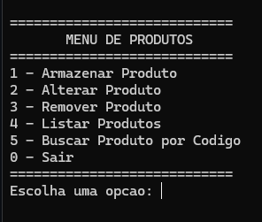

# Controle de Estoque de Eletrônicos - AP2

Este projeto foi desenvolvido como atividade **AP2** da **Faculdade Católica**. O objetivo é criar um sistema em C para gerenciamento de estoque de uma loja de eletrônicos, atendendo aos requisitos solicitados pela disciplina.

O sistema permite cadastrar, listar, alterar, remover e buscar produtos, simulando a organização física em caixas com limite de 10 produtos cada.

## Funcionalidades

- **Cadastrar produtos:** Adiciona produtos com código numérico único (ID) e nome.
- **Alterar produtos:** Permite alterar o nome de um produto pelo código.
- **Remover produtos:** Remove produtos pelo código.
- **Listar produtos:** Exibe todos os produtos cadastrados em ordem crescente de código.
- **Buscar produtos:** Pesquisa produtos pelo código, simulando a verificação das caixas conforme a lógica do funcionário.

## Estrutura do sistema

- Cada produto possui um código (ID) e um nome.
- Produtos são organizados em "caixas" por código, com limite de 10 produtos.
- A busca utiliza **busca binária**, mostrando passo a passo quais caixas estão sendo verificadas.

## Tecnologias

- Linguagem: C
- Compilador sugerido: GCC (ou qualquer compilador compatível com C)

## Como usar

1. Clone o repositório:
```bash
git clone https://github.com/Webers0n/Controle-Estoque-Eletronicos.git
```

2. Compile o programa:
```bash
gcc estoque.c -o estoque
```

3. Execute:
```bash
./estoque
```

4. Siga as instruções do menu para cadastrar, alterar, remover, listar ou buscar produtos.





## Autor

- Weberson Oliveira
